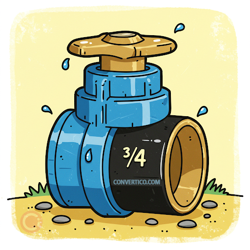
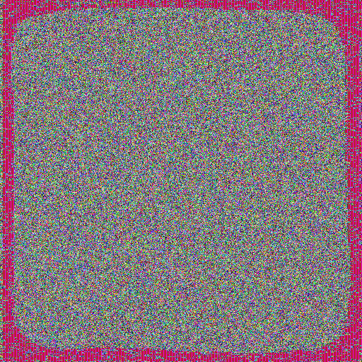
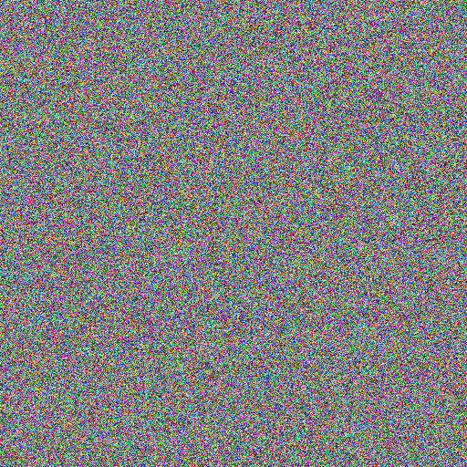

# Laboratorio Block Ciphers - CC3078

Implementación de DES, 3DES y AES para comparar modos de operación, padding, uso de IV y el efecto visual de ECB vs CBC sobre una imagen BMP.

## Estructura del proyecto

- `src/manual_padding.py`: implementación manual de `pkcs7_pad` y `pkcs7_unpad`.
- `src/generacion_llaves.py`: generación segura de llaves DES, 3DES, AES e IV.
- `src/des_ecb.py`: cifrado y descifrado DES en modo ECB usando padding manual.
- `src/3des.py`: cifrado y descifrado 3DES en modo CBC usando padding de PyCryptodome.
- `tests/analysis_demos.py`: pruebas demostrativas para ECB vs CBC, IV y padding.
- `tests/imageComparations.py`: cifrado de imagen BMP en AES-ECB y AES-CBC manteniendo el header BMP.
- `images/`: contiene la imagen original y los resultados cifrados.

## Instalación

Requisitos:

- Python 3.10 o superior.
- `pycryptodome`.

Instalar la dependencia:

```bash
python3 -m pip install -r requirements.txt
```

Opcionalmente se puede usar un entorno virtual:

```bash
python3 -m venv .venv
source .venv/bin/activate
python3 -m pip install -r requirements.txt
```

Los scripts de prueba importan módulos desde `src`, por eso los comandos se ejecutan desde la raíz del proyecto usando `PYTHONPATH=src`.

## Uso y ejemplos de ejecución

### 1. DES en modo ECB

Ejecutar:

```bash
PYTHONPATH=src python3 src/des_ecb.py
```

Qué demuestra:

- Genera una llave DES de 8 bytes.
- Aplica padding PKCS#7 manual.
- Cifra con DES-ECB.
- Descifra y verifica que el plaintext recuperado sea igual al original.

Ejemplo de salida esperada:

```text
Plaintext:  b'Amo hacer block ciphers'
Key (hex):  <llave aleatoria>
Ciphertext:  <ciphertext en hex>
Longitud ciphertext:  24 bytes (multiplo de 8:  True )
Decrypted:   b'Amo hacer block ciphers'
```

### 2. 3DES en modo CBC

Ejecutar:

```bash
PYTHONPATH=src python3 src/3des.py
```

Qué demuestra:

- Genera una llave 3DES de 16 bytes para 2-key 3DES.
- Genera un IV aleatorio de 8 bytes.
- Cifra con 3DES-CBC.
- Descifra usando la misma llave e IV.
- Prueba el formato `IV || ciphertext`, que es una forma común de transportar el IV junto al texto cifrado.

Ejemplo de salida esperada:

```text
Plaintext:  b'Amo hacer block ciphers con 3DES'
Key (hex):  <llave aleatoria>
IV  (hex):   <iv aleatorio>
Ciphertext:  <ciphertext en hex>
Longitud ciphertext:  40 bytes (multiplo de 8:  True )
Decrypted:   b'Amo hacer block ciphers con 3DES'
Formato IV correcto?: True
```

### 3. AES ECB vs CBC con imagen BMP

El script espera una imagen llamada `original.bmp` en el directorio desde donde se ejecuta. Como el proyecto guarda las imágenes en `images/`, ejecutar desde esa carpeta:

```bash
PYTHONPATH=../src python3 ../tests/imageComparations.py
```

Esto genera o actualiza:

- `images/encrypted_ecb.bmp`
- `images/encrypted_cbc.bmp`

Qué demuestra:

- Usa AES-256.
- Cifra los bytes de pixeles, pero conserva el header BMP para que los archivos resultantes sigan siendo visualizables.
- ECB mantiene patrones visuales porque bloques iguales producen bloques cifrados iguales.
- CBC rompe esos patrones al encadenar cada bloque con el anterior y usar un IV.

### 4. Experimentos de análisis

Ejecutar:

```bash
PYTHONPATH=src python3 tests/analysis_demos.py
```

Incluye:

- Comparación de bloques repetidos en ECB vs CBC.
- Efecto de reutilizar IV vs usar IV aleatorios en CBC.
- Padding PKCS#7 para mensajes de 5, 8 y 10 bytes.

Ejemplo de resultados esperados:

```text
== ECB vs CBC con bloques repetidos ==
Bloques repetidos en ECB: True
Bloques repetidos en CBC: False

== Experimento IV en CBC ==
Mismo IV -> iguales: True
IV diferentes -> diferentes: True

== Padding PKCS#7 ==
Mensaje (5 bytes): b'ABCDE'
  Padded (hex): 4142434445030303
  Unpad correcto: True
```

## Comparación visual ECB vs CBC

Imagen original:



AES en modo ECB:



AES en modo CBC:



En la imagen cifrada con ECB todavía se distinguen patrones de la imagen original. Esto ocurre porque ECB cifra cada bloque de forma independiente: si dos bloques de pixeles son iguales, sus bloques cifrados también serán iguales. En CBC la imagen resultante se ve mucho más aleatoria porque cada bloque se combina con el bloque cifrado anterior antes de cifrarse.

## Respuestas de análisis

### 1. Tamaño de clave

- DES usa una llave de 8 bytes, es decir 64 bits nominales. Sin embargo, solo 56 bits aportan seguridad efectiva porque 8 bits se usan para paridad.
- 3DES usa 16 bytes en 2-key 3DES o 24 bytes en 3-key 3DES.
- AES puede usar llaves de 16, 24 o 32 bytes para AES-128, AES-192 y AES-256 respectivamente. En este laboratorio se usa AES-256 para la imagen.

DES ya no se considera seguro porque su espacio de llave efectivo de `2^56` es demasiado pequeño ante ataques de fuerza bruta modernos. 3DES mejora la seguridad histórica de DES, pero actualmente también se considera legado frente a AES.

Snippet de generación:

```python
from generacion_llaves import generate_des_key, generate_3des_key, generate_aes_key

print(len(generate_des_key()))      # 8
print(len(generate_3des_key(2)))    # 16
print(len(generate_3des_key(3)))    # 24
print(len(generate_aes_key(256)))   # 32
```

### 2. ECB vs CBC

ECB cifra cada bloque de manera independiente. Esto lo hace simple, pero inseguro para datos reales porque revela patrones cuando el plaintext contiene bloques repetidos.

CBC cifra cada bloque después de combinarlo con el bloque cifrado anterior. Para el primer bloque usa un IV aleatorio. Por eso, aunque el mensaje tenga bloques repetidos, el ciphertext no repite los mismos bloques de forma directa.

En este proyecto:

- DES se implementa en ECB en `src/des_ecb.py`.
- 3DES se implementa en CBC en `src/3des.py`.
- AES se usa en ECB y CBC para comparar imágenes en `tests/imageComparations.py`.

### 3. Vulnerabilidad de ECB

ECB no debe usarse para información sensible porque no oculta la estructura del mensaje. Si dos bloques del plaintext son iguales y se cifran con la misma llave, el resultado cifrado también será igual. Esto permite inferir patrones aunque no se conozca el contenido exacto.

La demostración está en `tests/analysis_demos.py`: el mensaje `b"ATAQUE!!" * 4` genera bloques repetidos en ECB, mientras que CBC evita esa repetición visible.

### 4. Rol del IV en CBC

El IV, o vector de inicialización, es un bloque aleatorio del mismo tamaño que el bloque del cifrado. En CBC se usa para que el primer bloque no sea determinístico.

Si se cifra el mismo mensaje con la misma llave y el mismo IV, el ciphertext se repite. Si se cifra el mismo mensaje con la misma llave pero con IV diferentes, el ciphertext cambia. Por eso el IV debe ser único e impredecible para cada cifrado CBC.

ECB no usa IV porque no encadena bloques. Esa simplicidad es precisamente una de las razones por las que filtra patrones.

### 5. Padding

Los cifrados de bloque requieren que el tamaño del mensaje sea múltiplo del tamaño de bloque. DES y 3DES trabajan con bloques de 8 bytes; AES trabaja con bloques de 16 bytes.

En PKCS#7 se agregan `N` bytes, cada uno con valor `N`, donde `N` es la cantidad de bytes faltantes para completar el bloque. Si el mensaje ya tiene tamaño exacto de bloque, se agrega un bloque completo de padding para que el descifrado pueda distinguir entre datos reales y padding.

Casos demostrados con bloque de 8 bytes:

- 5 bytes: agrega `03 03 03`.
- 8 bytes: agrega un bloque completo `08 08 08 08 08 08 08 08`.
- 10 bytes: agrega `06 06 06 06 06 06`.

### 6. Recomendaciones de uso

| Modo | Recomendado para | Desventajas |
|---|---|---|
| ECB | Práctica académica, no datos reales | Filtra patrones del plaintext |
| CBC | Compatibilidad con sistemas heredados | Requiere padding e IV único; no autentica |
| CTR | Cifrado tipo stream y paralelización | Requiere nonce/contador único |
| GCM | Uso moderno en producción | Requiere manejar correctamente el nonce |

Para aplicaciones reales se recomienda usar modos autenticados como AES-GCM, porque además de confidencialidad ofrecen integridad y autenticación del mensaje.

Ejemplos:

```python
AES.new(key, AES.MODE_GCM)
```

```java
Cipher.getInstance("AES/GCM/NoPadding")
```

## Proceso de testing

El testing realizado es demostrativo y manual, enfocado en validar comportamiento criptográfico esperado:

1. **DES-ECB:** se ejecuta `PYTHONPATH=src python3 src/des_ecb.py` y se valida que el mensaje descifrado coincida con el mensaje original. También se verifica que el ciphertext tenga longitud múltiplo de 8 bytes.
2. **3DES-CBC:** se ejecuta `PYTHONPATH=src python3 src/3des.py` y se valida el descifrado correcto con llave e IV. Además se prueba el formato `IV || ciphertext`.
3. **Padding PKCS#7:** se ejecuta `PYTHONPATH=src python3 tests/analysis_demos.py` y se revisan los casos de 5, 8 y 10 bytes para confirmar que `pkcs7_unpad` recupera el mensaje original.
4. **ECB vs CBC en bloques repetidos:** el mismo script confirma que ECB produce bloques repetidos para plaintext repetido, mientras CBC no.
5. **IV en CBC:** el mismo script confirma que reutilizar IV produce ciphertext igual y usar IV distintos produce ciphertext distinto.
6. **Imagen AES ECB/CBC:** se ejecuta `PYTHONPATH=../src python3 ../tests/imageComparations.py` desde `images/` y se comparan visualmente `original.bmp`, `encrypted_ecb.bmp` y `encrypted_cbc.bmp`.

Nota: en el entorno actual, si aparece `ModuleNotFoundError: No module named 'Crypto'`, se debe instalar primero `pycryptodome` con el comando indicado en la sección de instalación.
